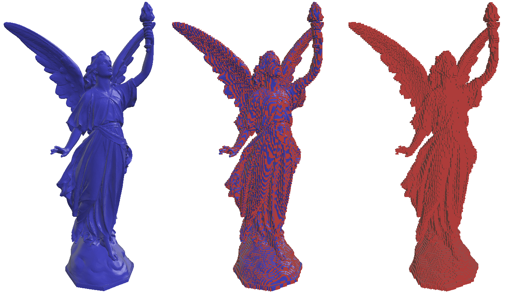
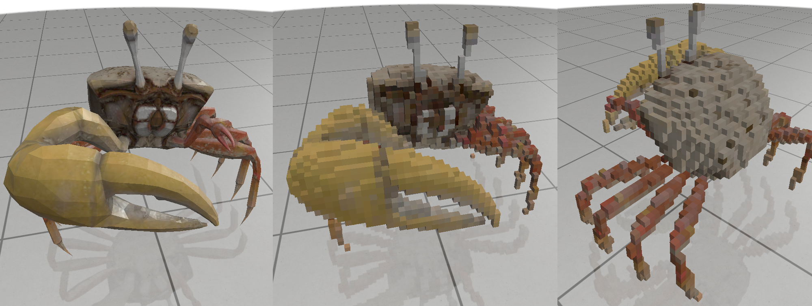

# Voxelizer and SDF

This project produces an occupancy 3D grid and a signed distance function (SDF) 3D grid from a mesh. This project uses [polyscope](http://polyscope.run/) for visualization, [tinyply](https://github.com/ddiakopoulos/tinyply) for the mesh IO, [stb](https://github.com/nothings/stb) for images IO, [openMP](https://www.openmp.org/) for parallelization, and [nanoflann](https://github.com/jlblancoc/nanoflann) for kNN search.

## Getting Started

These instructions will get you a copy of the project up and running on your local machine for development and testing purposes.

### Prerequisites
The only dependency is [Eigen](https://eigen.tuxfamily.org/), which can be installed as follows:

```bash
sudo apt-get update
sudo apt-get install libeigen3-dev
```

### Installing

The project can be compiled using the following sequence:

```bash
git clone https://github.com/rFalque/voxelization_and_sdf.git
cd voxelization_and_sdf
mkdir build
cd build
cmake ../src
make
```

Additionally, we use OMP for parallelizing the computation. The number of threads can be set with
```bash
export OMP_NUM_THREADS=<number of threads to use>
```

## Running the demo

To compute the SDF
```bash
./test_SDF
```

To run the voxelizer
```bash
./test_occupancyGrid
```

To run the colored voxelizer
```bash
./test_occupancyGridWithColor
```

## examples

SDF computation:


Voxelized Lucy:



Color voxelizer:




## Authors

* **Raphael Falque** - *Initial work* - [GitHub](https://github.com/rFalque) / [personal page](https://rfalque.github.io/)

## License

This project is licensed under the MIT License - see the [LICENSE.md](LICENSE.md) file for details
